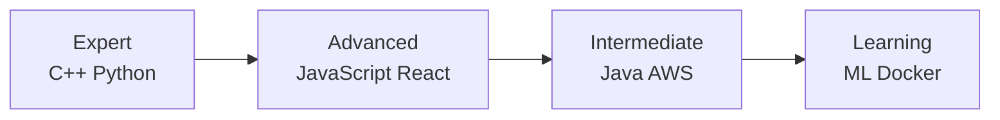

# 🚀 **Pranjal Pathak** - Full Stack Developer & Software Engineer

<div align="center">
  
  <!-- Animated Header -->
  
  
  <!-- GitHub Stats with Animation -->
  <div style="display: flex; justify-content: center; gap: 20px; margin-top: 20px;">
    
    
    
  </div>
  
  <!-- Animated 3D Model Placeholder -->
  <div style="margin: 40px 0;">
    
  </div>
  
  [](https://portfolio-tj41.vercel.app/)
  [](YOUR_RESUME_LINK_HERE)
  [](mailto:pranjal_p@ee.iitr.ac.in)

</div>

---

## 🌟 **About Me**

<div align="center">
  
  
  
  ```javascript
  const pranjal = {
    pronouns: "He" | "Him",
    education: "IIT Roorkee - Electrical Engineering",
    focus: "Full-Stack Development & Competitive Programming",
    passion: "Building scalable solutions & solving complex problems",
    currentTech: ["React", "Node.js", "Python", "Java", "AWS"],
    learning: ["Machine Learning", "React Native", "Flutter", "Docker"],
    hobbies: ["Coding Challenges", "Tech Exploration", "Music", "Gaming"],
    motto: "Write code that matters, build solutions that scale"
  };
  ```

</div>

- 🎯 **Mission-Driven Developer** crafting elegant solutions to complex problems
- 🏆 **Competitive Programmer** with strong algorithmic foundations
- 🌐 **Full-Stack Specialist** passionate about both frontend artistry and backend engineering
- 📚 **Lifelong Learner** constantly exploring cutting-edge technologies
- 🚀 **Solution Architect** focused on scalable, maintainable, and efficient code

---

## 🏆 **Featured Projects**

<div align="center">

| Project | Tech Stack | Description | Live Demo |
|---------|------------|-------------|-----------|
| **✨ Portfolio Website** | Next.js, React, TailwindCSS | Modern, responsive portfolio with interactive elements | [Live Demo](https://portfolio-tj41.vercel.app/) |
| **⚡ E-commerce Platform** | Node.js, Express, MongoDB | Full-featured online shopping platform | Coming Soon |
| **🤖 AI Assistant** | Python, TensorFlow, Flask | Intelligent chatbot with NLP capabilities | In Development |
| **📱 Mobile App** | React Native, Firebase | Cross-platform mobile application | App Store |

</div>

---

## 🛠 **Technology Arsenal**

### **📊 Proficiency Overview**



### **🚀 Core Competencies**

<div align="center">

#### **💻 Programming Languages**


#### **🌐 Web Technologies**


#### **🗄️ Databases**


#### **☁️ Cloud & DevOps**


</div>

---

## 📈 **Development Activity**

<div align="center">

<!-- GitHub Snake Animation -->


<!-- Activity Graph -->
[](https://github.com/ashutosh00710/github-readme-activity-graph)

</div>

---

## 🏅 **Achievements & Certifications**

<div align="center">

| Achievement | Organization | Year |
|-------------|--------------|------|
| **Codeforces Expert** | Codeforces | 2023 |
| **Google Cloud Ready** | Google Cloud | 2023 |
| **AWS Fundamentals** | Amazon Web Services | 2023 |
| **React Certified** | Meta (Coursera) | 2023 |

</div>

---

## 🤝 **Let's Connect & Collaborate**

<div align="center">
  
  <p align="center">💡 <b>Have an exciting project? Let's turn ideas into reality!</b></p>
  
  <!-- Social Links with Animation -->
  <div style="display: flex; justify-content: center; gap: 15px; margin: 30px 0; flex-wrap: wrap;">
    <a href="https://www.linkedin.com/in/pranjal-pathak-058768231/" target="_blank">
      
    </a>
    <a href="https://github.com/YOUR_USERNAME" target="_blank">
      
    </a>
    <a href="https://codeforces.com/profile/conpepper" target="_blank">
      
    </a>
    <a href="https://instagram.com/pranj_al_pathak01" target="_blank">
      
    </a>
    <a href="mailto:pranjal_p@ee.iitr.ac.in" target="_blank">
      
    </a>
  </div>
  
  <!-- Visitor Counter -->
  <p align="center">
    
    
  </p>
  
</div>

---

<div align="center">
  
  <!-- Quote Section -->
  
  
  <!-- Footer -->
  <br>
  <p><b>🚀 Thanks for visiting! Let's connect and build something amazing together.</b></p>
  
  

</div>

---

## 📝 **Recent Blog Posts** *(Coming Soon)*

<div align="center">
  
  <!-- Blog posts placeholder -->
  <p>🚧 Technical blog section under development. Stay tuned for insightful articles!</p>
  
</div>

---

> **Note:** Replace `YOUR_USERNAME` with your actual GitHub username in the URLs above to enable the statistics and activity graphs.

---

**⭐ Star this repository if you find it impressive! ⭐**
